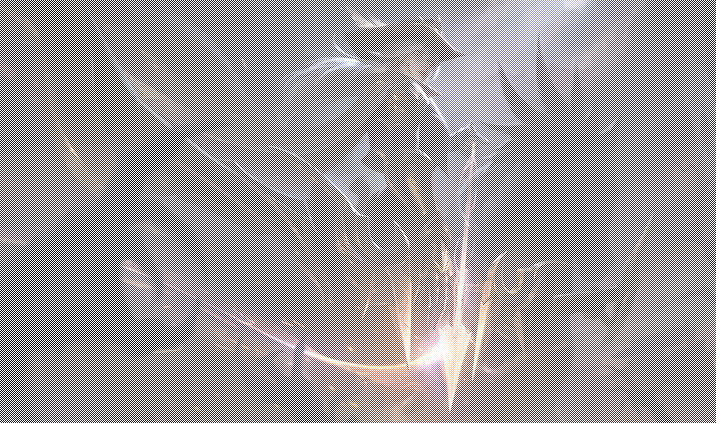
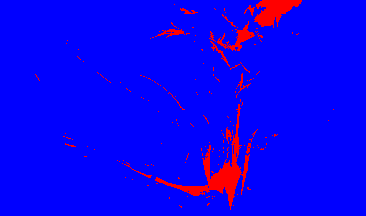
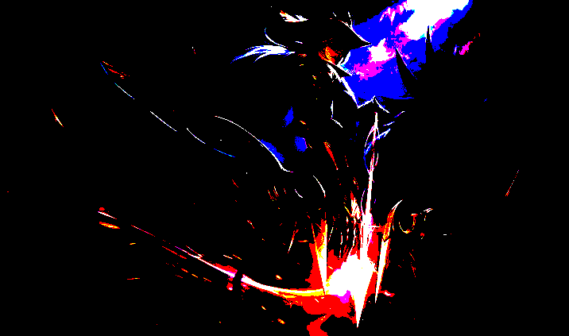
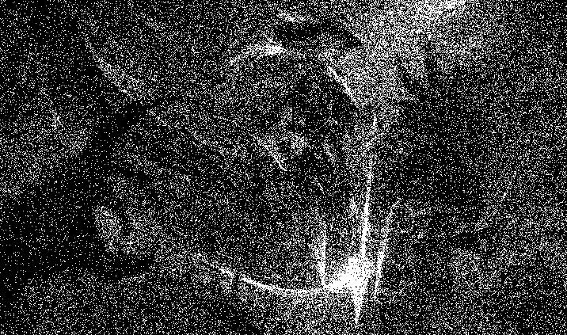
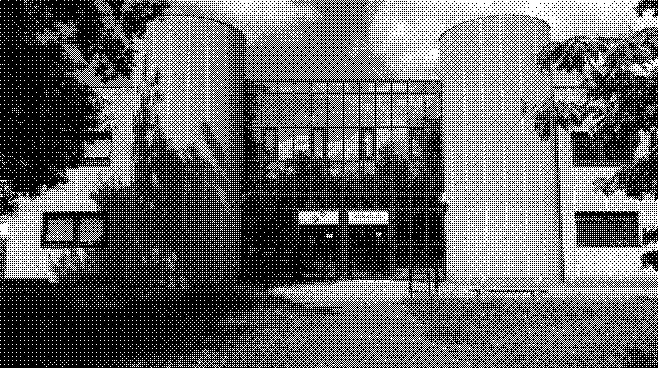
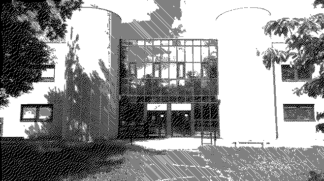
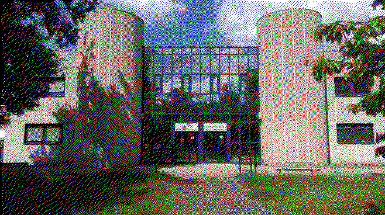
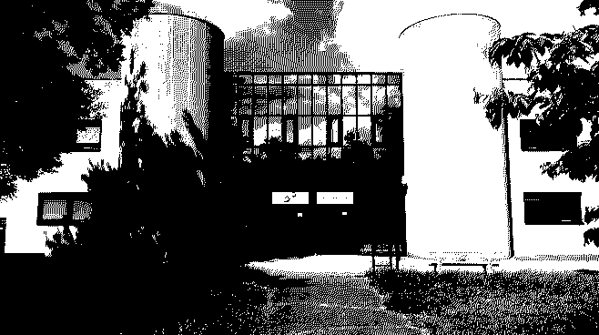

# 1 La bibliothèque image

## Question 2

DynamicImage est un type générique fourni par la bibliothèque image en Rust. Il représente une image qui peut être dans différents formats ou types de pixels (par exemple, RGB, RGBA, Grayscale, etc.). Cela permet de manipuler une image sans connaître son format exact à l'avance.
L'intérêt principal de DynamicImage est qu'il sert de conteneur polyvalent pour gérer des images avec des canaux et des profondeurs de couleurs variés.

Pour convertir une DynamicImage en une image au format RGB avec 8 bits par canal (Rgb8), on peut utiliser la méthode to_rgb8() fournie par la bibliothèque image. Cette méthode retourne une structure ImageBuffer contenant les données de l'image dans le format souhaité.

## Question 3

Lorsqu'une image source possède un canal alpha (transparence) et que vous la convertissez en Rgb8 avec la méthode to_rgb8(), le canal alpha est tout simplement ignoré. La méthode to_rgb8() extrait uniquement les composantes Rouge, Vert et Bleu (RGB) et les combine pour créer une nouvelle image sans transparence.

Par conséquent :
    Les zones transparentes ou semi-transparentes de l'image d'origine seront converties en une couleur RGB basée sur la couleur visible sous la transparence.
    Dans la plupart des cas, les zones totalement transparentes deviendront noires ou prendront une couleur basée sur l'interprétation des données sous-jacentes.

## Question 4 :
Voici le code pour avoir la luminosité du pixel (32,52)
```
let luminosity = get_pixel_luminosity(&img, 32, 52);
println!("La luminosité du pixel (0, 0) est : {}", luminosity);
```

## Question 5:
Pour passer une image en un pixel sur deux :
```
cargo run -- img.jpg output.png un-sur-deux
```

Vous devriez obtenir un résultat similaire à celui-ci (en fonction de l'image choisie):


# 2 Passage en monochrome par seuillage

## Question 6

Pour récupérer la luminosité d’un pixel en Rust, on peut utiliser la bibliothèque image et travailler avec les valeurs de ses canaux (rouge, vert, bleu). La luminosité d’un pixel peut être calculée de plusieurs manières, mais l'approche la plus courante consiste à utiliser une formule pondérée, comme le standard perceptual luminance.

Voici le code pour avoir la luminosité du pixel (32,52)
```
let luminosity = get_pixel_luminosity(&img, 32, 52);
println!("La luminosité du pixel (0, 0) est : {}", luminosity);
```

## Question 8
Voici la commande pour passer l'image en deux couleurs:
```
cargo run -- img.jpg output.png monochrome
```

Les couleurs appliquées sont les suivantes:
```
let light_color = Rgb([152, 152, 5]);
let dark_color = Rgb([89, 4, 89]);
```
Le rendu avec du bleu et du rouge:


# 3 Passage à une palette

## Question 9

La distance entre deux couleurs peut être calculée dans l'espace RGB avec la formule de la distance euclidienne.

## Question 10

Pour faire un changement en palette de couleur :
```
cargo run -- img.jpg output.png palette --n-couleurs 5
```

Le rendu avec une palette de couleur:


## Question 11

Si l'utilisateur indique cette commande (ie 0 couleurs de la palette), l'image sera tout simplement entièrement noire.

```
cargo run -- img.jpg output.png palette --n-couleurs 0
```
```
if opts.n_couleurs == 0{
    for (x, y, color) in img.enumerate_pixels_mut() {
        let _color = Rgb([0, 0, 0]);
        *color = _color;
    }
}
```

## Question 12

Pour faire un tramage aléatoire :
```
cargo run -- img.jpg output.png --tramage-aleatoire
```

Le rendu avec un tramage aléatoire:


# 5 Utilisation de la matrice de Bayer comme trame

## Question 13

Voir code point 4

## Question 14

Création d'une matrice de Bayer d'ordre arbitraire

Initialisation : Commencer avec B0=[[0]]B0​=[[0]].
Récurrence : Utiliser la relation suivante pour construire Bn+1Bn+1​ :
    Diviser BnBn​ en 4 blocs :
    Bn+1=14[4Bn4Bn+34Bn+24Bn+1]
    Bn+1​=41​[4Bn​4Bn​+2​4Bn​+34Bn​+1​]
Implémentation : Étendre dynamiquement la matrice avec des boucles imbriquées pour chaque ordre.

## Question 15

Pour faire le tramage par matrice de bayer :
```
cargo run -- img.jpg output.png bayer-mat
```

Le rendu avec le tramage par matrice de bayer:


## Question 16

Pour faire la diffusion d'erreur noir et blanc :
```
cargo run -- img.jpg output.png diffusion-error --diff-method error_diffusion
```

Le rendu avec la diffusion d'erreur noir et blanc:


## Question 17

L'erreur est représentée comme la différence entre la couleur d'origine du pixel et la couleur de la palette choisie pour ce pixel.

Cette erreur est diffusée aux pixels voisins non encore traités selon un algorithme de dithering, comme Floyd-Steinberg, en répartissant l'erreur pondérée dans un motif prédéfini.

## Question 18

Pour faire la diffusion pour la paletissation d'image :
```
cargo run -- img.jpg output.png diffusion-error --diff-method palettisation
```

Le rendu avec la diffusion pour la paletissation d'image 


## Question 19

Pour faire la diffusion pour floyd-steinberg :
```
cargo run -- img.jpg output.png diffusion-error --diff-method Floyd-Steinberg
```
Pour faire la diffusion pour floyd-steinberg
